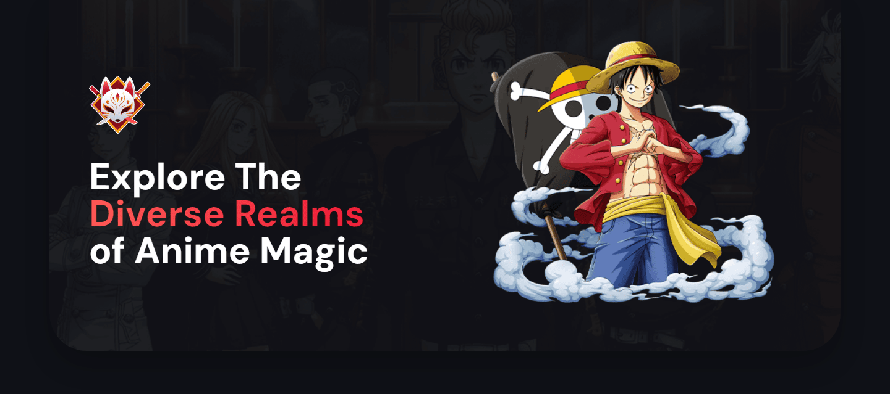
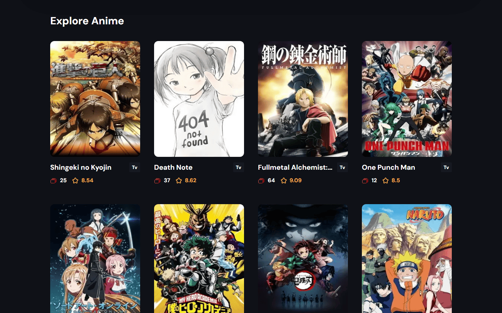
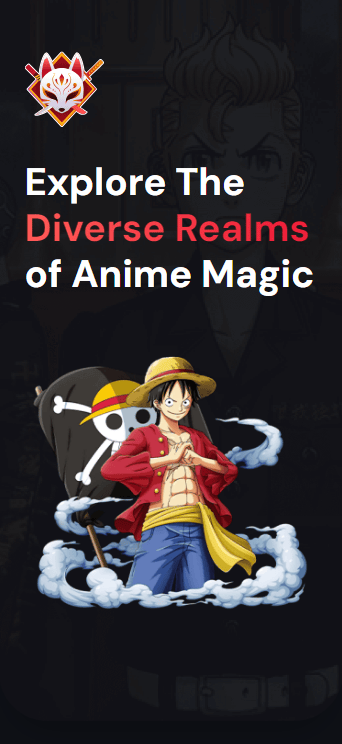

# 🎬 Anime_vault

### Explore The Diverse Realms of Anime Magic (اگه ایران هستید از فیلترشکن استفاده کنید).

## Link 🔗 [https://anime-vault-next.vercel.app/](https://anime-vault-next.vercel.app/)

 

# Preview

 

# Mobile Responsive

# Technologies

 

<ul>
    <li>
        
    </li>
    <li>
        
    </li>
    <li>
        
    </li>
    <li>
        
    </li>
    <li>
        
    </li>
    <li>
        
    </li>
</ul>
